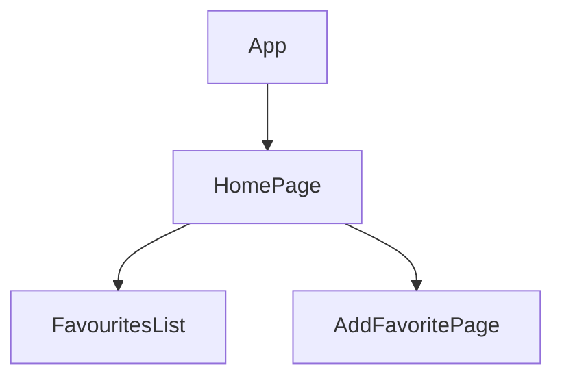

# Favorite NPM Package Explorer

NPM Package Explorer is a React project that serves as an interactive platform for discovering and adding npm packages to your favorite projects. Leveraging the power of React, Tailwind CSS, and React Router, this application provides a seamless and intuitive experience for developers to explore, search, and wishlist them and can perform many actions on them afterward.

Live at : https://fav-framework.vercel.app/

## Key Features:

**Package Discovery**: Easily search and discover npm packages based on keywords, popularity, or trending topics.

**Package Wishlisting and Actions**: After finding the npm package, add them to your favorites with a reason.

**Responsive Design**: Built with a responsive design using Tailwind CSS, the application is accessible and user-friendly across various devices and screen sizes.

**Navigation with React Router**: Utilizing React Router, the project provides a smooth and dynamic navigation experience, allowing users to move between different sections of the application effortlessly.

## Tech Stack Used :

<table style="width: 100%; border: none;" cellspacing="0" cellpadding="0" border="0">
  <tr>
    <th >React</th>
    <td ></td>
  </tr>
  <tr>
    <th >Node JS</th>
    <td ></td>
  </tr>
  </tr>
  <tr>
    <th >Tailwind CSS</th>
    <td ></td>
  </tr>
  
</table>

## Flow

---

